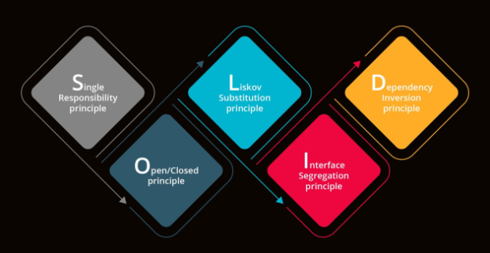
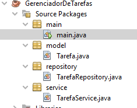
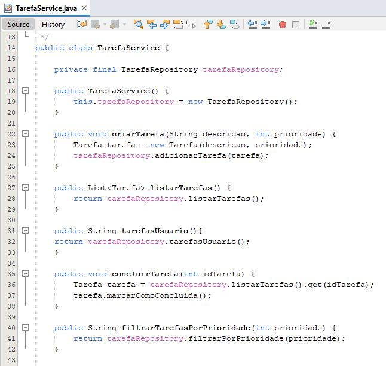
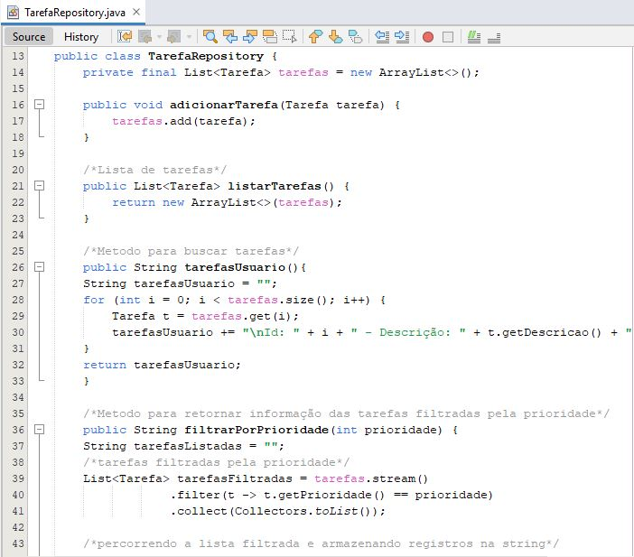
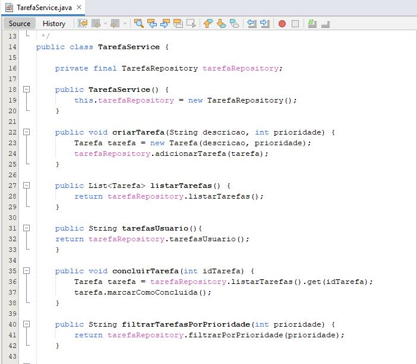

# Gerenciador de Tarefas em Java utilizando princípio SOLID  📝

**Feito por Mateus Tomaz Siqueira , Victor Junio Grigoleto Chicas e Igor Gabriel de Oliveira Reis**

Este é um **Gerenciador de Tarefas** desenvolvido em **Java**, com foco na aplicação dos princípios **SOLID** para garantir um código bem estruturado e de fácil manutenção. 🚀  
A aplicação permite a criação, listagem, conclusão e filtragem de tarefas, sendo totalmente em memória (sem persistência em banco de dados ou arquivos), utilizando uma interação simples via terminal.

---

## 🌟 Aplicação dos Princípios SOLID

### 1. *SRP (Single Responsibility Principle - Princípio da Responsabilidade Única)* 💡

Cada classe foi projetada para ter uma **única responsabilidade**:
- **Tarefa**: Representa a tarefa, com informações como descrição, prioridade e status de conclusão.
- **TarefaRepository**: Responsável pela manipulação das tarefas em memória (adicionar, listar, filtrar e verificar).
- **TarefaService**: Classe responsável por chamar os métodos na Repository e ser chamada na classe Main.
- **Main**: Responsável apenas pela interação com o usuário, sem envolvimento na lógica.

### 2. *OCP (Open/Closed Principle - Princípio Aberto/Fechado)* 🔒

**📝Classe - TarefaService**

A classe TarefaService está **fechada para modificação**, mas **aberta para extensão**:
- Ou seja, suas funcionalidades principais (adicionar, listar e validar tarefas) não precisam ser modificadas quando novas funcionalidades forem adicionadas. Ela está "aberta para extensão". Se no futuro for necessário implementar um novo tipo de funcionalidade, a classe pode ser estendida sem alterar o código existente.

### 3. *LSP (Liskov Substitution Principle - Princípio da Substituição de Liskov)* 🔄
Este princípio não foi explicitamente explorado, pois não há herança no projeto até o momento. No entanto, a estrutura do projeto permite que novas classes sejam introduzidas no futuro, como por exemplo, uma implementação de persistência em banco de dados, sem impactar a funcionalidade geral da aplicação.

### 4. *ISP (Interface Segregation Principle - Princípio da Segregação de Interfaces)* ⚖
No momento, não foi necessário criar interfaces separadas, pois as responsabilidades de cada classe estão bem definidas. Nenhuma classe exige a implementação de métodos desnecessários, o que evita a criação de interfaces grandes e complexas.

### 5. *DIP (Dependency Inversion Principle - Princípio da Inversão de Dependência)* 🔄
A classe TarefaService depende da abstração da interface TarefaRepository para realizar suas operações. Isso permite que, no futuro, a implementação de persistência possa ser trocada (por exemplo, usando banco de dados ou arquivos) sem alterar a lógica da aplicação.

**📝Classe - TarefaRepository**

**📝Classe - TarefaService**

---

## 🏗 Estrutura do Projeto

- **Tarefa**: Classe que representa uma tarefa, com atributos como descrição, prioridade e status de conclusão.
- **TarefaRepository**: Responsável por armazenar e recuperar as tarefas.
- **TarefaService**: Contém a lógica de negócio, como a criação de tarefas, filtragem por prioridade e marcação de tarefas como concluídas.
- **Main**: Responsável por interagir com o usuário via terminal, permitindo criar, listar, filtrar e concluir tarefas.

---

## ⚙ Recursos do Projeto

- **Inclusão de Tarefas**: Permite a inclusão de novas tarefas. ➕
- **Listagem de Tarefas**: Permite a listagem de tarefas. 📋
- **Conclusão de Tarefas**: Permite a conclusão de uma tarefa. ✔
- **Listagem de Tarefas filtrando a prioridade**: Permite a listagem de tarefas de acordo com a prioridade informada pelo usuário. 🔍
- **Validações**: O projeto possui validações para:
  - Prioridades inválidas ❌
  - Tarefas que não existem ou que já foram concluídas ⚠

---

## 🚀 Como Rodar

1. Clone este repositório para o seu computador.
2. Execute a classe Main para iniciar a interação via terminal.

---
